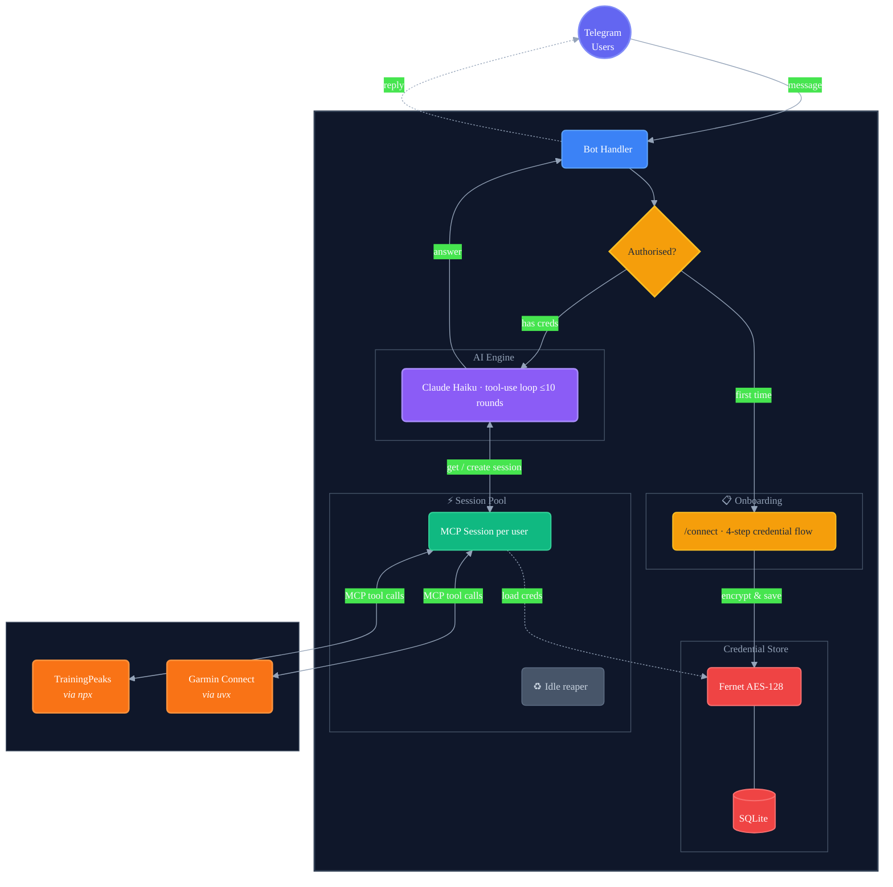

# Fitness AI Bot

A multi-user Telegram bot that answers fitness questions using your **Garmin Connect** and **TrainingPeaks** data, powered by Claude AI.

Ask questions like:
- "What was my training load this week?"
- "Compare my last two long runs"
- "How's my sleep been recently?"
- "What does my power curve look like?"
- "Am I ready for a hard workout today?"

## Architecture



Each user gets their own pair of MCP server subprocesses, spawned on demand and evicted after idle timeout. Credentials are encrypted at rest with AES-128 (Fernet) and never stored in plaintext.

## Features

- **Multi-user** — each Telegram user connects their own Garmin + TrainingPeaks accounts
- **Conversational AI** — Claude Haiku with tool-use for real data retrieval (no fabricated metrics)
- **Secure credential handling** — Fernet-encrypted SQLite store, credential messages auto-deleted from chat
- **Session pooling** — MCP subprocesses spawned on demand, evicted after configurable idle timeout
- **Access control** — optional allowlist of Telegram user IDs
- **Cheap to run** — ~$7–15/month (Linode Nanode $5 + Claude API $2–10)

## Prerequisites

- Python 3.11+
- Node.js 20+ (for TrainingPeaks MCP server via `npx`)
- [uv](https://github.com/astral-sh/uv) (for Garmin MCP server via `uvx`)
- An [Anthropic API key](https://console.anthropic.com/)
- A [Telegram bot token](https://core.telegram.org/bots#botfather)

## Quick Start

### 1. Clone

```bash
git clone https://github.com/tshepor2001/fitness-ai-bot.git
cd fitness-ai-bot
```

### 2. Configure

```bash
cp .env.example .env
```

Edit `.env` and fill in the required values:

| Variable | Required | Description |
|---|---|---|
| `ANTHROPIC_API_KEY` | Yes | Your Anthropic API key |
| `TELEGRAM_BOT_TOKEN` | Yes | Bot token from [@BotFather](https://t.me/BotFather) |
| `ENCRYPTION_KEY` | Yes | Fernet key for encrypting user credentials |
| `CLAUDE_MODEL` | No | Claude model (default: `claude-haiku-4-20250414`) |
| `DATA_DIR` | No | Path for SQLite database (default: `/app/data`) |
| `SESSION_IDLE_TIMEOUT` | No | Seconds before idle MCP sessions are evicted (default: `600`) |
| `ALLOWED_USER_IDS` | No | Comma-separated Telegram user IDs for access control |

Generate an encryption key:

```bash
python -c "from cryptography.fernet import Fernet; print(Fernet.generate_key().decode())"
```

### 3. Install & Run

```bash
pip install -e .
python -m fitness_ai_bot.main
```

## Docker

```bash
docker build -t fitness-ai-bot .
docker run -d --name fitness-bot \
  --restart unless-stopped \
  --env-file .env \
  -v ./data:/app/data \
  fitness-ai-bot
```

The data volume persists the encrypted credential database across container restarts.

## Deploy to Linode

A one-shot deployment script provisions a Linode Nanode 1GB ($5/month) and starts the bot:

```bash
# Requires: linode-cli installed and configured
./deploy.sh
```

Then copy your `.env` to the server:

```bash
scp .env root@<LINODE_IP>:/opt/fitness-ai-bot/.env
ssh root@<LINODE_IP> 'cd /opt/fitness-ai-bot && docker restart fitness-bot'
```

## Bot Commands

| Command | Description |
|---|---|
| `/start` | Welcome message and available commands |
| `/connect` | Link your Garmin + TrainingPeaks accounts (4-step guided flow) |
| `/disconnect` | Remove your stored credentials and tear down sessions |

After `/connect`, just send any fitness question as a regular message.

## How It Works

1. **User sends a message** → bot checks auth and retrieves (or spawns) their MCP session
2. **Claude receives the question** + available tools from Garmin/TrainingPeaks MCP servers
3. **Claude calls tools** to fetch real data (activities, sleep, heart rate, power, TSS, etc.)
4. **Claude synthesizes** the data into a concise, actionable answer
5. **Bot sends the response** back to the user in Telegram

The tool-use loop runs up to 10 rounds per question, allowing Claude to make multiple data queries to build a complete answer.

## Project Structure

```
fitness_ai_bot/
├── __init__.py
├── config.py              # Environment variable loading and validation
├── credential_store.py    # Fernet-encrypted SQLite credential CRUD
├── mcp_client.py          # Per-user MCP session pool with idle eviction
├── agent.py               # Claude tool-use loop
└── main.py                # Telegram bot entry point and /connect flow
```

## Security

- **Credentials encrypted at rest** using Fernet symmetric encryption (AES-128-CBC + HMAC-SHA256)
- **Credential messages auto-deleted** from Telegram chat immediately after capture
- **No plaintext secrets** in logs, database, or environment (except the encryption key itself)
- **Optional access control** via `ALLOWED_USER_IDS` allowlist
- **Credentials only decrypted** in memory when spawning MCP subprocesses

## Cost Estimate

| Component | Monthly Cost |
|---|---|
| Linode Nanode 1GB | $5 |
| Claude Haiku API (~100 queries/day) | $2–10 |
| **Total** | **~$7–15** |

## License

MIT
